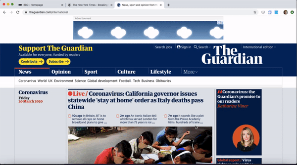

# Hold Tabs

(Chrome extension + Introduction LP)

## Overview

**Hold Tabs** is a Chrome extension created by **v17-chimeras-team-01** team.  
**Hold Tabs** stores your bunch of tabs.

You can see the overview visually on [`this LP`](https://chingu-voyages.github.io/v17-chimeras-team-01/).

## Features

- store all tabs or current page tab every clicking the button
- can see the list on the options page
- can delete the each link

\*Confidential link should not be stored. The storage used by this project isn't encrypted.

## Chrome extension Installation

1. download `extension` folder
2. add the folder to `Manage Extension page` (chrome://extensions/)  
   \*see more about [installation](https://developer.chrome.com/extensions/getstarted) if you need

## LP

This project also has an LP.  
You can see the page from here.

- code: in `docs` folder
- Live DEMO: **[Hold Tab LP](https://chingu-voyages.github.io/v17-chimeras-team-01/)**

## Tech Used / Dependencies

HTML / CSS / Vanilla JavaScript

- Code Style Guide: [JavaScript Standard Style Guide](https://standardjs.com/)
- reset CSS: [A Modern CSS Reset](https://hankchizljaw.com/wrote/a-modern-css-reset/)

- Fonts: [Google Fonts](https://fonts.google.com/)
- Icons: [material icon](https://material.io/resources/icons/)

## Contributors

- [Keiko](https://github.com/web-tama) (Implement main function of this extension, LP and design)

#### Contributors until the middle part of this project

- [Jo Morales](https://github.com/jmoralesg) (Built base)
- [Jinyoung Park](https://github.com/jypark0407) (UX/UI)

## prototype

This prototype by [Jinyoung Park](https://github.com/jypark0407)  
 
